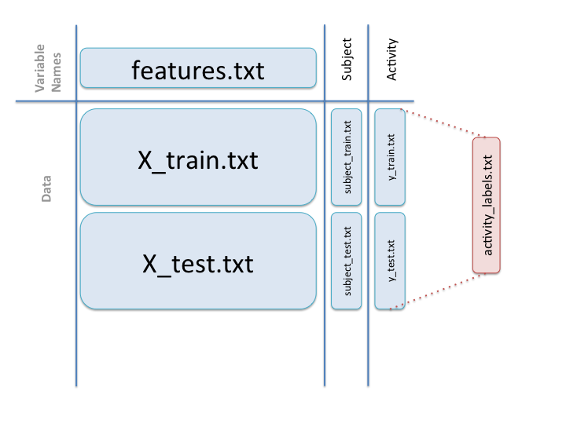

GettingDataProject
==================

This is the course project of the course 3 in the data science specialization. 
This assumes that the run_analysis.R sits in the same folder as the test and train folders. 

There are 6 major steps that happen in the code in run_analysis.R, as follows:

- 1. Reading all the data in.
- 2. Binding the different files together like this:

- 3. Removing the columns that do not pertain to mean and std deviation
- 4. Recasting the data so that we get mean values of all columns for each subject activity combination (30 subjects * 6 activities = 180 rows)
- 5. Tidying up the column names so they make more sense
- 6. Writing data into the file

The output file is called "tidyData.txt"